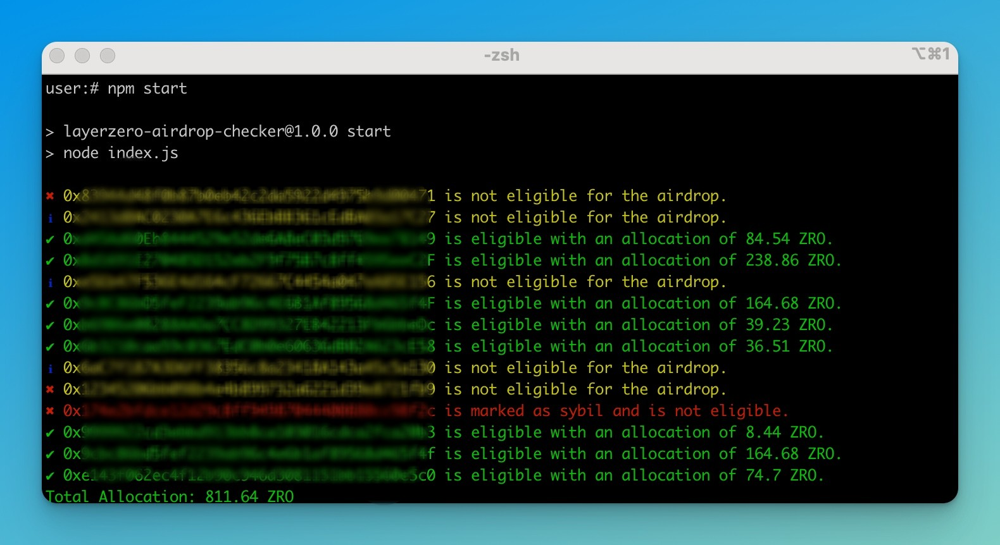

# LayerZero Airdrop and Sybil Checker (Proxyless)

A Node.js tool to verify wallet address eligibility for LayerZero airdrops and check for Sybil status. This script checks eligibility via the API and verifies Sybil status from a CSV file, logging results with colored outputs and saving eligible addresses to `eligible_addresses.txt`. Proxyless



## Features

- **Super Fast and Efficient**:
- Checks eligibility via API
- No proxy required.
- Verifies Sybil status from a CSV file offline
- Logs results with colored outputs for easy identification
- Shows a beautiful process spinner while checking addresses using `ora`
- Saves eligible addresses to `eligible_addresses.txt`

## Prerequisites

- **Node.js**: Ensure you have Node.js installed. You can download it from [Node.js](https://nodejs.org/).

## Installation

1. Clone the repository:
    ```bash
    git clone https://github.com/dmytrmk/layerzero-airdrop-checker.git
    ```

2. Navigate to the project directory:
    ```bash
    cd layerzero-airdrop-checker
    ```

3. Install the dependencies:
    ```bash
    npm install
    ```

## Usage

1. Prepare your `wallets.txt` file with one wallet address per line:
    ```txt
    0x1234...
    0xabcd...
    ```

2. Run the airdrop and sybil checker:
    ```bash
    npm start
    ```

    The script will output eligible addresses and their allocations in green, mark sybil addresses in red, and save eligible addresses to `eligible_addresses.txt`.

## Example Output

If an address is eligible, the script will log:
```
0x1234... is eligible with an allocation of 84.54 ZRO.
Eligible address 0x1234... saved to eligible_addresses.txt
```

If an address is marked as sybil, the script will log:
```
0xabcd... is marked as sybil and is not eligible.
```


## Contributing

Contributions are welcome! Please open an issue or submit a pull request.

## License

This project is licensed under the MIT License. See the [LICENSE](LICENSE) file for details.

## Support

If you encounter any issues, please open an issue on GitHub or contact me at my email on my profile.

## Acknowledgements

Special thanks to the LayerZero communities and all contributors.
